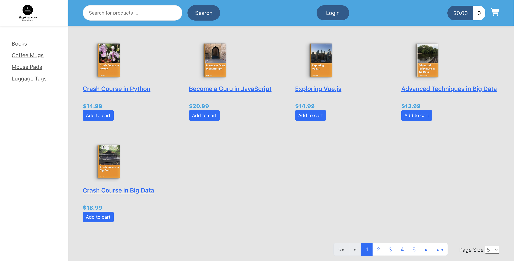
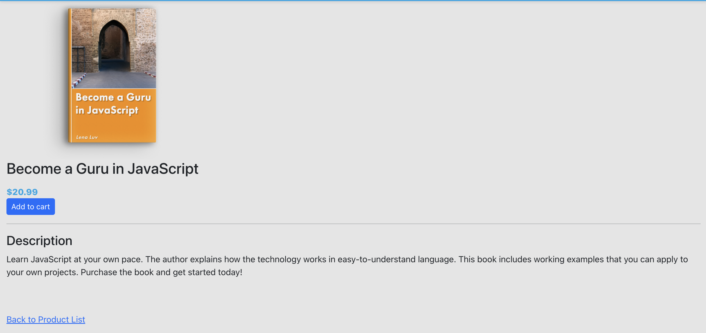
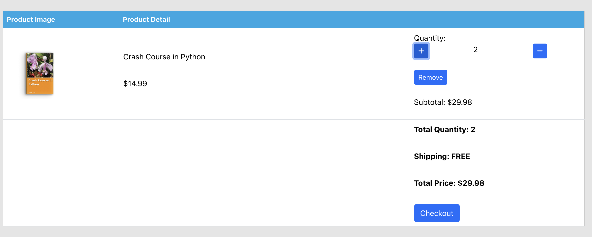
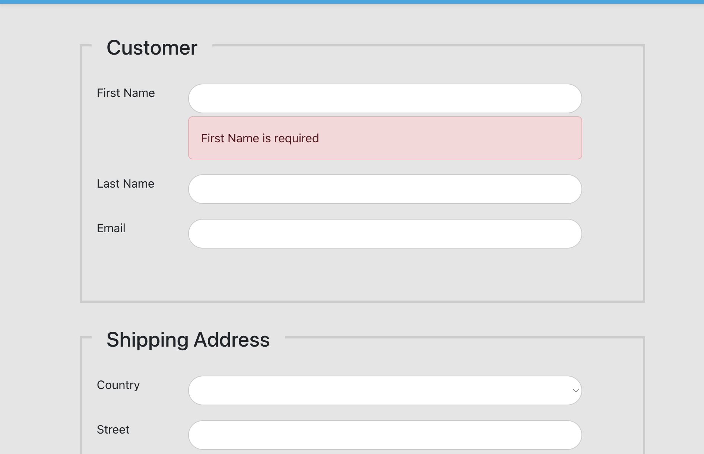
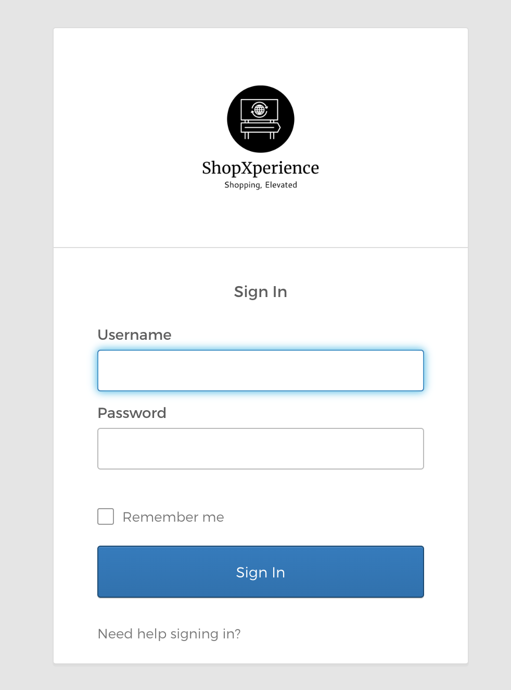
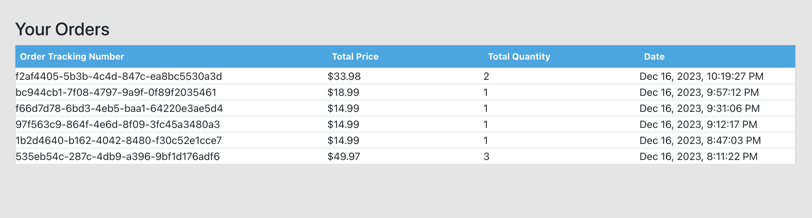

# **Introduction to Java NYU CS9053**

**Title:** ShopXperience **Team Members:** Aditya Jadhav - aj3781 **N Number:** N16901169

---

**Overview:**

The surge in online shopping necessitates sophisticated eCommerce platforms that prioritize user experience. A comprehensive, user-friendly, and secure eCommerce solution is essential, offering efficient product search, detailed product views, dynamic cart management, and a seamless checkout process for both guests and logged in users. This is crucial for building and maintaining user trust and satisfaction in the midst of a competitive online marketplace.

**Project Features:**

**1. Products View**: The product view offers a comprehensive overview of all items available on the eCommerce website.

​	

- <u>Product Category</u>: The product range encompasses various categories, including but not limited to Books, Coffee Mugs, Mouse Pads, and Luggage Tags.

- <u>Pagination</u>: Pagination panel designed for navigating through numerous products.

- <u>Search component</u>: Enables product search functionality based on user-provided keywords and retrieve the relevant products matching the search criteria.

**2. Product Details View**: The page furnishes information such as the product title, price, and a comprehensive description. Users have the option to navigate back to the product list page.

​			

<div style="page-break-after: always;"></div>

**3. Dynamic Cart Management**: The shopping cart incorporates functionalities allowing users to dynamically adjust item quantities, either increasing or decreasing, and provides the option to remove items entirely. Any modifications made dynamically update the total quantity, subtotal price, and overall total price.

​				

**4. Checkout form**: The checkout process includes a comprehensive form for users to input information across multiple sections, covering Customer details, Shipping Address, Billing Address, Credit Card information, and Order Review. The system incorporates validations for each corresponding field. Upon the successful placement of an order, users receive a success alert containing the order tracking number, and they are redirected back to the products page.

​									

**5. User Authentication and Authorization**: A slight addition to the project scope involves the implementation of user authentication and authorization through the Okta Identity and Access Management (IAM) service. Users now have the capability to login/logout and, similar to guests, they can place orders as well. As Okta free tier account is being used, it allowes manual addition of users to the application through the Okta developer account portal.

​											

Sample user credentials:

```
username: adijj332@gmail.com

password: ShopX2023
```

<div style="page-break-after: always;"></div>

**6. User Orders View**: A dedicated orders page for logged in users where they can conveniently access and review details of their previous orders.

​						

Note: Since the data is stored in local database, intially it would return no orders when tested. Once above user provided user is logged in, an order needs to be placed so it creates an entry in their local database which  allows them to see that order on the orders page.


**7. Enhanced Security**: HTTPS protocal has been implemented to ensure a secure communication channel safeguarding user data and interactions throughout the system.


**How to Install and Run the Project?**

<u>Note</u>: A short tutorial on installing Angular on Mac/Windows: https://kinsta.com/knowledgebase/install-angular/

1. To use npm (Node Package Manager), you need to install Node.js, Go to https://nodejs.org/ in your web browser and download the LTS version. Verify its installation by running below commands.

```
Verify Installation:

node -v
npm -v
```

2. Angular CLI needs to be installed to run the frontend

```
Install: npm install -g @angular/cli

Verify installation: ng --version
```

  3. To allow self-signed certificates, go to chrome://flags/ in Google chrome and search for "#allow-insecure-localhost", enable it and relaunch Chrome. 

     <u>Note:</u> After grading the project, please disable the "#allow-insecure-localhost" flag and relaunch Chrome to revert back to original browser settings.

     

  4. Extract the **ShopXperience.zip** and install db-scripts, frontend, backend accordingly as per the provided video "**How to run the code.mp4**" and run the browser with URL

```
URL: https://localhost:4200
```

​		